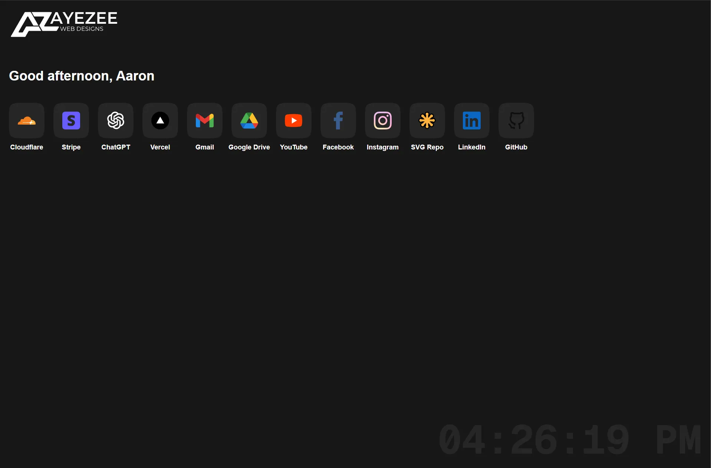

# 🛍 AyeZee New Tab

A minimalist custom new tab page built with **Next.js 15.3** and **Tailwind CSS v4**. This is my personal dashboard for quick access to frequently used tools, platforms, and resources.



---

## 🔧 Tech Stack

- **Next.js 15.3**
- **Tailwind CSS v4**
- Custom SVG icons stored in `/public/images/logos`
- Centralized links stored in [`src/lib/links.ts`](./src/lib/links.ts)

---

## 📂 Project Structure

```txt
.
├── public/
│   └── images/
│       └── logos/        # SVG icons used in the dashboard
├── src/
│   ├── lib/
│   │   └── links.ts      # Array of dashboard links
│   └── app/              # App directory for routing (Next.js 15)
├── tailwind.config.ts
└── README.md
```

---

## ✨ Features

- Lightweight and fast
- Dark mode styling
- Personalized greeting with time-based message
- Easy to update – just add to `links.ts`

---

## 🚀 Getting Started

```bash
npm run install
npm run dev
```

Open [http://localhost:3000](http://localhost:3000) to view it in your browser.

---

## 🔗 Add Your Own Links

Modify [`src/lib/links.ts`](./src/lib/links.ts):

```ts
export const links = [
  {
    name: "Cloudflare",
    href: "https://cloudflare.com",
    icon: "/images/logos/cloudflare.svg",
  },
  ...
];
```

Place matching icons in `/public/images/logos`.

---

## 💠 Plans

- Add section grouping (e.g. Dev, Social, Tools)
- Favicon preview
- Search box
- Keyboard shortcuts

---

## 🧠 Why?

Just a fun productivity boost — faster access, less distractions, and I get to control the experience.

---

## 🗪 License

MIT
